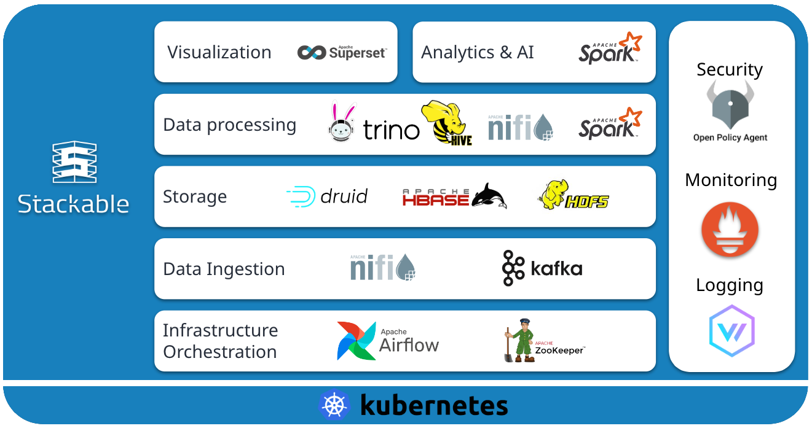

<!-- markdownlint-disable MD041 -->

  

<h1 align="center">Stackable Operator for Apache Spark</h1>

<!-- markdownlint-disable MD041 -->

[Documentation](https://docs.stackable.tech/home/stable/spark-k8s) | [Stackable Data Platform](https://stackable.tech/) | [Platform Docs](https://docs.stackable.tech/) | [Discussions](https://github.com/orgs/stackabletech/discussions) | [Discord](https://discord.gg/7kZ3BNnCAF)

This is a Kubernetes operator to manage [Apache Spark](https://spark.apache.org/) jobs.

<!-- markdownlint-disable MD041 MD051 -->
It is part of the Stackable Data Platform, a curated selection of the best open source data apps like Apache Kafka, Apache Druid, Trino or Apache Spark, [all](#other-operators) working together seamlessly. Based on Kubernetes, it runs everywhere – [on prem or in the cloud](#supported-platforms).

## Installation

You can install the operator using [stackablectl or helm](https://docs.stackable.tech/home/stable/spark-k8s/getting_started/installation).

Read on to get started with it, or see it in action in one of our [demos](https://stackable.tech/en/demos/).

## Getting Started

You can follow this [tutorial](https://docs.stackable.tech/home/stable/spark-k8s/getting_started/first_steps) .

<!-- markdownlint-disable MD041 -->
## Documentation

The stable documentation for this operator can be found in our [Stackable Data Platform documentation](https://docs.stackable.tech/home/stable/spark-k8s).
If you are interested in the most recent state of this repository, check out the [nightly docs](https://docs.stackable.tech/home/nightly/spark-k8s) instead.

The documentation for all Stackable products can be found at [docs.stackable.tech](https://docs.stackable.tech).

If you have a question about the Stackable Data Platform, contact us via our [homepage](https://stackable.tech/) or ask a public question in our [Discussions forum](https://github.com/orgs/stackabletech/discussions).

<!-- markdownlint-disable MD041 -->
## About The Stackable Data Platform

This operator is written and maintained by [Stackable](https://stackable.tech) and it is part of a larger data platform.

Stackable makes it easy to operate data applications in any Kubernetes cluster.

The data platform offers many operators, new ones being added continuously. All our operators are designed and built to be easily interconnected and to be consistent to work with.

The [Stackable GmbH](https://stackable.tech/) is the company behind the Stackable Data Platform. Offering professional services, paid support plans and custom development.

We love open-source!

## Supported Platforms

We develop and test our operators on the following cloud platforms:

* AKS on Microsoft Azure
* EKS on Amazon Web Services (AWS)
* GKE on Google Cloud Platform (GCP)
* [IONOS Cloud Managed Kubernetes](https://cloud.ionos.com/managed/kubernetes)
* K3s
* Kubernetes (for an up to date list of supported versions please check the release notes in our [docs](https://docs.stackable.tech))
* Red Hat OpenShift

## Other Operators

These are the operators that are currently part of the Stackable Data Platform:

* [Stackable Operator for Apache Airflow](https://github.com/stackabletech/airflow-operator)
* [Stackable Operator for Apache Druid](https://github.com/stackabletech/druid-operator)
* [Stackable Operator for Apache HBase](https://github.com/stackabletech/hbase-operator)
* [Stackable Operator for Apache Hadoop HDFS](https://github.com/stackabletech/hdfs-operator)
* [Stackable Operator for Apache Hive](https://github.com/stackabletech/hive-operator)
* [Stackable Operator for Apache Kafka](https://github.com/stackabletech/kafka-operator)
* [Stackable Operator for Apache NiFi](https://github.com/stackabletech/nifi-operator)
* [Stackable Operator for Apache Spark](https://github.com/stackabletech/spark-k8s-operator)
* [Stackable Operator for Apache Superset](https://github.com/stackabletech/superset-operator)
* [Stackable Operator for Trino](https://github.com/stackabletech/trino-operator)
* [Stackable Operator for Apache ZooKeeper](https://github.com/stackabletech/zookeeper-operator)

And our internal operators:

* [Commons Operator](https://github.com/stackabletech/commons-operator)
* [Listener Operator](https://github.com/stackabletech/listener-operator)
* [OpenPolicyAgent Operator](https://github.com/stackabletech/opa-operator)
* [Secret Operator](https://github.com/stackabletech/secret-operator)

## Contributing

Contributions are welcome.
Follow our [Contributors Guide](https://docs.stackable.tech/home/stable/contributor/index.html) to learn how you can contribute.
All contributors will have to sign a [Contributor License Agreement](https://github.com/stackabletech/.github/blob/main/cla.md).
This is enforced automatically when you submit a Pull Request where a bot will guide you through the process.

## License

[Open Software License version 3.0](./LICENSE).

## Support

Get started with the community edition! If you want professional support, [we offer subscription plans and custom licensing](https://stackable.tech/en/plans/).

## Sponsor

If you want to support our work but don't need professional support please consider [sponsoring](https://github.com/sponsors/stackabletech) our work.

<!-- markdownlint-disable MD041 MD022 MD032 -->
